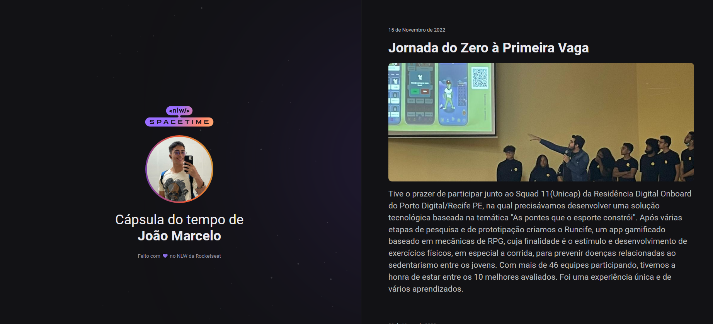

  

## 🖥 Projeto
Esse é um projeto Web Responsivo de uma cápsula do tempo para exibir memórias em uma linha do Tempo.

## 🚀 Tecnologias
Esse projeto foi desenvolvido durante o NLW da Rocketseat com as seguintes tecnologias:

- HTML
- CSS
- GIT e Github

## 🏷️ Layout
Você pode visualizar o Layoout do Projeto atravês
[desse link](https://www.figma.com/file/P0oDsWGmVj3nVqgwda9vWj/NLW-JM?type=design&node-id=306%3A3&t=WN9TOQyN78TNG2PH-1).
É necesário ter uma conta no [Figma](https://www.figma.com)
